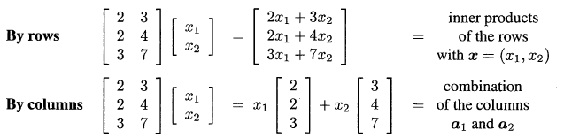
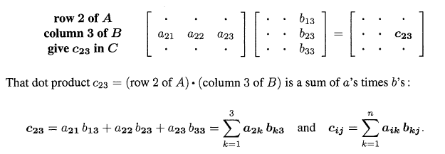
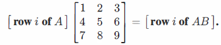
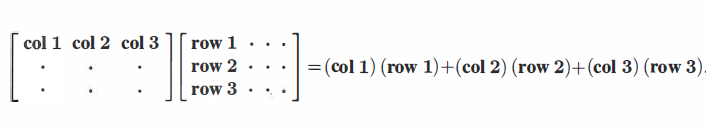

# Lecture 1: 矩阵A的列空间

> The Columns Space of A Contains All vectors Ax

## 计算$Ax$

有两种方法计算$Ax$，第一种方法是**矩阵A的行向量与向量x的内积**，第二种方法为**矩阵A的列向量的线性组合**，而线性组合的系数就是向量x对应的元素。

矩阵A有两个列向量$a_1,a_2$，我们把$a_1$和$a_2$分别与向量x的元素$x_1,x_2$相乘，再把得到的两个向量相加，就是我们要求的结果。

尽管第一种方法可能比较常用，但第二种方法——根据向量的线性组合产生新的向量更有助于理解线性代数的基本运算，这也是本课程的重点。

因此有
$$
Ax = x_1a_x+x_2a_2+...+x_na_n
$$

## 列空间

矩阵A的列空间就是**A的列向量所有的线性组合**，因此所有$Ax$的集合组成了A的列空间，写作$C(A)$，而矩阵A线性无关的列就是$C(A)$的基。

由此可以得到方程$Ax=b$有解的条件是向量b在A的列空间内。

注意$ABCx$也在A的列空间内，因为: $ABCx=A(BCx)=Ax'$

> 例：$A=\left[\begin{matrix} 2 &1 &3 \\3 &1 &4 \\5& 7 & 12 \end{matrix} \right]$，则
> $$
> Ax=\left[\begin{matrix} 2 &1 &3 \\3 &1 &4 \\5& 7 & 12 \end{matrix} \right]\left[\begin{matrix} x_1 \\ x_2 \\ x_3\end{matrix} \right]=x_1 \left[\begin{matrix} 2 \\ 3 \\ 5\end{matrix} \right] + x_2 \left[\begin{matrix} 1 \\ 1 \\ 7\end{matrix} \right] + x_3\left[\begin{matrix} 3 \\ 4 \\ 12\end{matrix} \right]
> $$
> 矩阵A可以分解为： 
> $$
> A=\left[\begin{matrix} 2 &1  \\3 &1  \\5& 7  \end{matrix} \right]\left[\begin{matrix} 1 &0 &1\\0 &1 &1  \end{matrix} \right]=CR
> $$
> $C=\left[\begin{matrix} 2 &1  \\3 &1  \\5& 7  \end{matrix} \right]$为A线性无关的列向量，也是C(A)的一组基，R为A线性无关的行向量，也是行空间的一组基（写作$R(A)$，一般也写作$C(A^T)$，即转置的列空间）。A的列秩与行秩相同，为A线性无关的列或行的个数。

## 矩阵乘法

矩阵A和矩阵B有四种乘法

1. A的i行向量与B的j列向量内积，作为矩阵$C=AB$的一个元素$c_{ij}$
   
   尽管这是矩阵乘法的常用方式，但还有其他更好的方法

1. 矩阵A和矩阵B的列向量的乘积，结果为C的一个列向量。$c_i=Ab_i$
   $$
   A\left[\begin{matrix} b_1 ...b_p\end{matrix} \right]=\left[\begin{matrix} Ab_1 ...Ab_p\end{matrix} \right]
   $$
   C的每一列都是A的列向量的线性组合

1. 与方法二类似，矩阵A的行向量和矩阵B的乘积，结果为C的一个行向量。
   

1. 矩阵A的行向量与B对应的列向量的乘积的和。

   

   

