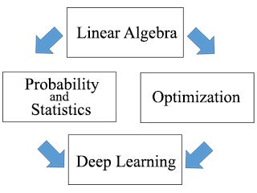

# Lecture 0: 课程概述

本课程为MIT公开课：18.065 Matrix Method in Data Analysis, Signal Processing, and Machine Learning(数据分析，信号处理和机器学习中的矩阵方法)，由[Gilbert Strang](https://bkso.baidu.com/item/Gilbert%20Strang)教授讲授，是线性代数在机器学习等领域的进阶课程。

课程主页为：[Matrix Methods in Data Analysis, Signal Processing, and Machine Learning](https://ocw.mit.edu/courses/mathematics/18-065-matrix-methods-in-data-analysis-signal-processing-and-machine-learning-spring-2018/)

YouTube地址为: [MIT 18.065 Matrix Method in Data Analysis, Signal Processing, and Machine Learning, Spring 2018](https://www.youtube.com/playlist?list=PLUl4u3cNGP63oMNUHXqIUcrkS2PivhN3k)

B站也有相应搬运：[【麻省理工系列MIT】矩阵方法在数据分析、信号处理和机器学习中的应用](https://www.bilibili.com/video/BV1P54y1r7pc)

课程使用教材为Gilbert Strang的新书*Linear Algebra and Learning from Data*，包含两个基本主题和两个补充内容——线性代数，深度学习，最优化，以及概率论与统计

1. 线性代数的重点在于几种特殊矩阵，如对称矩阵(Symmetric Matrices)，正交矩阵(Orthogonal Matrices)以及他们的关系。同时还将重点介绍奇异值分解等矩阵分解方法。
1. 深度学习的目标在于构建一个学习"函数"，输入一些数据，如手写数字图片，语音信息，然后输出对应的结果。它包括矩阵乘法等内容，而引入非线性函数对深度学习的改善有非常重大的作用。
1. 最优化是将所有矩阵元素看作变量从而最小化误差的一个问题。计算会涉及到海量变量，其个数可能会达到100,000个甚至500,000个，但也因此会得到过去无法实现的惊人结果。
1. 概率论与统计可以帮助矩阵元素的均值和方差维持在一个正常水平，防止元素以指数级增长或减小到0。尽管本课程并不是一个统计课程，但仍然会涉及深度学习中的统计知识。

由于本课程是线性代数的进阶课程，所以需要一定的基础知识。没有学过线代或者需要巩固知识的同学可以先观看Strang教授的另一门课程：[Introduction to Linear Algebra](https://www.bilibili.com/video/BV1D541177uK)，该课程是线性代数的经典入门课程。

> 这门课程我很早就有所耳闻，奈何一直没时间（懒）学，现在终于要挖坑了。输出是最好的学习方法，因此我会用文字记录所学内容，分享到网络上，这样或许也能对学习这门课的同学有一点帮助。我也只是一名门外汉，所写所想仅仅是个人愚见，如有错误之处，还请批评指正。
